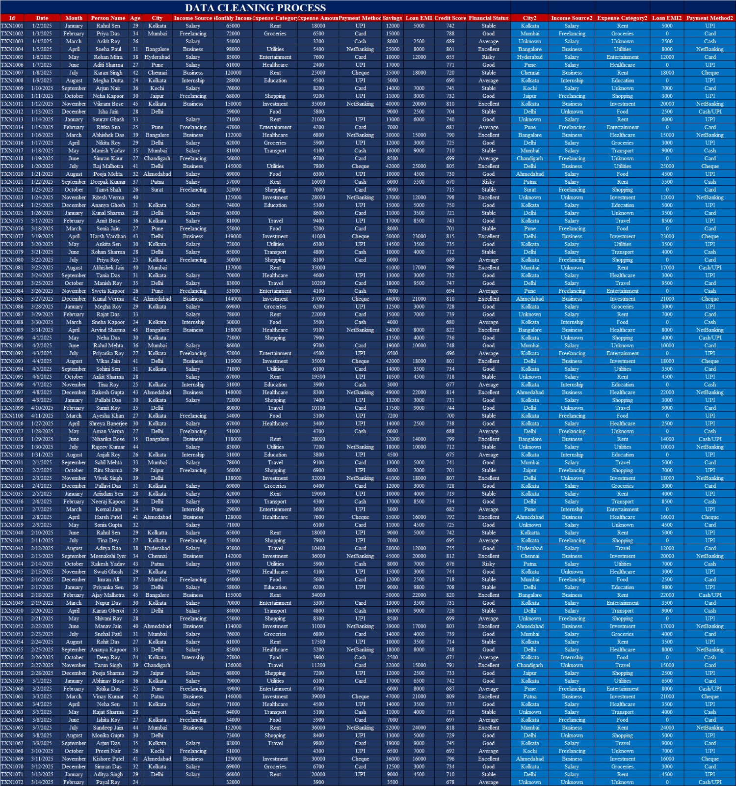
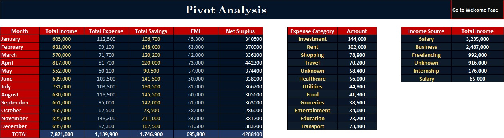

# 💰 PERSONAL FINANCE & BUDGET PLANNER

### 📊 Advanced Microsoft Excel Financial Analytics Project  
### 🏢 Anudip Foundation Project

---

# 📌 Project Overview

The **Personal Finance & Budget Planner** is a complete Microsoft Excel-based financial analytics project developed for tracking, organizing, analyzing, and visualizing personal financial data efficiently.

This project helps users monitor:

✅ Monthly Income  
✅ Expense Tracking  
✅ Savings Analysis  
✅ Budget Planning  
✅ Financial Performance  

The project integrates advanced Excel features such as:

- Pivot Tables
- Pivot Charts
- KPI Cards
- Conditional Formatting
- Hyperlinks
- Financial Formulas
- Interactive Dashboard Design
- Data Cleaning & Preprocessing

The system provides a professional and interactive financial reporting experience using multiple Excel worksheets and visual analytics.

---

# 🎯 Project Objectives

✔️ Track monthly income and expenses  
✔️ Analyze category-wise spending patterns  
✔️ Monitor savings and financial performance  
✔️ Compare budget with actual expenses  
✔️ Visualize financial trends using charts  
✔️ Perform data cleaning and preprocessing  
✔️ Build interactive Excel reporting systems  
✔️ Create a professional financial analytics project  

---

# 🏗️ Project Workflow

```text
Raw Data → Data Cleaning → Cleaned Data → Income & Expense Analysis → Budget Analysis → Pivot Table → Executive Dashboard
```

---

# ⚙️ Features Included

✅ Interactive Excel Dashboard  
✅ Income Analysis  
✅ Expense Analysis  
✅ Budget Planning & Tracking  
✅ Pivot Table Analysis  
✅ KPI Cards  
✅ Financial Charts & Graphs  
✅ Conditional Formatting  
✅ Hyperlink Navigation System  
✅ Data Cleaning & Validation  
✅ Multi-Sheet Workbook Structure  

---

# 🧰 Microsoft Excel Tools Used

- Pivot Tables
- Pivot Charts
- SUM Formula
- IF Formula
- Percentage Formula
- Conditional Formatting
- Hyperlinks
- Data Validation
- Charts & Graphs
- Dashboard Design Techniques
- Slicers & Interactive Filtering

---

# 📁 Workbook Structure

```text
Welcome Page
│
├── Raw Data
├── Data Cleaning Process
├── Cleaned Data
├── Income Analysis
├── Expense Analysis
├── Budget Analysis
├── Pivot Table
└── Executive Dashboard
```

---

# 📊 Dashboard Components

## 🏠 Welcome Page
Interactive homepage with hyperlink-based navigation.

## 📄 Raw Data
Contains original financial transaction records.

## 🧹 Data Cleaning Process
Includes preprocessing and data cleaning operations.

## ✅ Cleaned Data
Structured dataset prepared for reporting and analysis.

## 💰 Income Analysis
Monthly income tracking and source-wise analysis.

## 💸 Expense Analysis
Category-wise expense breakdown and spending patterns.

## 🏦 Budget Analysis
Comparison between planned budget and actual spending.

## 📋 Pivot Table
Summary financial analysis generated using Pivot Tables.

## 📊 Executive Dashboard
Final interactive dashboard containing KPI cards, charts, financial insights, and analytics visualization.

---

# 📌 KPI Metrics Included

💰 Total Income  
💸 Total Expenses  
🏦 Total Savings  
📊 Remaining Budget  
📈 Savings Rate  
📉 Expense Ratio  
📋 Total Transactions  

---

# 📈 Charts Included

📉 Monthly Income Trend Chart  
📊 Expense Category Analysis Chart  
📋 Budget vs Actual Spending Analysis  
📈 Income vs Expense Comparison  

---

# 📸 Project Screenshots

## 🏠 Welcome Page


---

## 📄 Raw Data


---

## 🧹 Data Cleaning Process


---

## ✅ Cleaned Data


---

## 💰 Income Analysis


---

## 💸 Expense Analysis


---

## 🏦 Budget Analysis


---

## 📋 Pivot Table


---

## 📊 Executive Dashboard


---

# 📌 Core Formulas Used

## 💰 Total Income Formula

```excel
=SUM(B4:M4)
```

Purpose:  
Calculates total yearly income from monthly income values.

---

## 💸 Expense Percentage Formula

```excel
=N4/$N$16
```

Purpose:  
Calculates percentage contribution of each expense category.

---

## 🏦 Budget Variance Formula

```excel
=B4-C4
```

Purpose:  
Calculates remaining budget after actual spending.

---

## ✅ Budget Status Formula

```excel
=IF(D4>=0,"Under Budget","Over Budget")
```

Purpose:  
Checks whether spending is under budget or over budget.

---

# 📊 Financial Insights

✅ Investment and Rent categories recorded the highest expenses  
✅ Savings rate reached 85.52% indicating strong financial management  
✅ Expense ratio remained controlled at 14.48%  
✅ Dashboard KPIs improved financial monitoring and reporting  

---

# 🌟 Project Highlights

✨ Professional Excel Dashboard Design  
✨ Interactive Financial Reporting  
✨ Realistic Financial Dataset  
✨ Advanced Excel Analytics  
✨ End-to-End Financial Analysis Workflow  
✨ Structured Workbook Navigation  
✨ Data Cleaning & Visualization Techniques  

---

# 👨‍💻 Developed By

### 👤 Aakash Nath  
### 👤 Abhijit Roy  

---

# 🏢 Organization

### Anudip Foundation

---

# 🔗 GitHub Repository

```text
https://github.com/aakashnath/personal-finance-dashboard-excel
```

---

# 📌 Conclusion

The **Personal Finance & Budget Planner** demonstrates how Microsoft Excel can be effectively used for financial analytics, reporting, budgeting, and interactive visualization.

This project combines:

✔️ Data Cleaning  
✔️ Financial Analysis  
✔️ Pivot Reporting  
✔️ Formula Automation  
✔️ KPI Tracking  
✔️ Interactive Dashboard Design  

to create a professional Excel-based financial management and analytics solution.

The project can be further enhanced using Power BI, automation tools, and real-time financial reporting systems.
