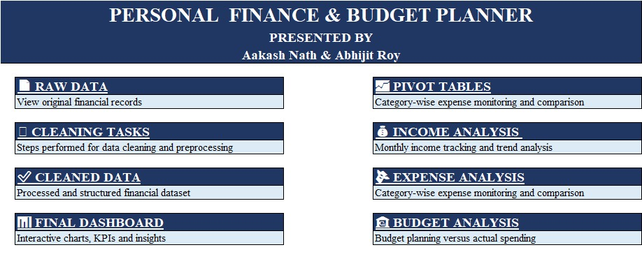
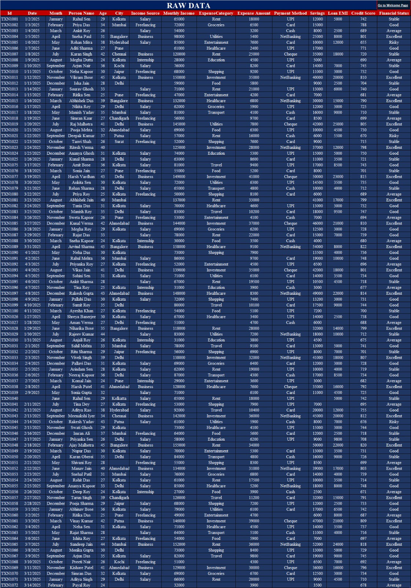
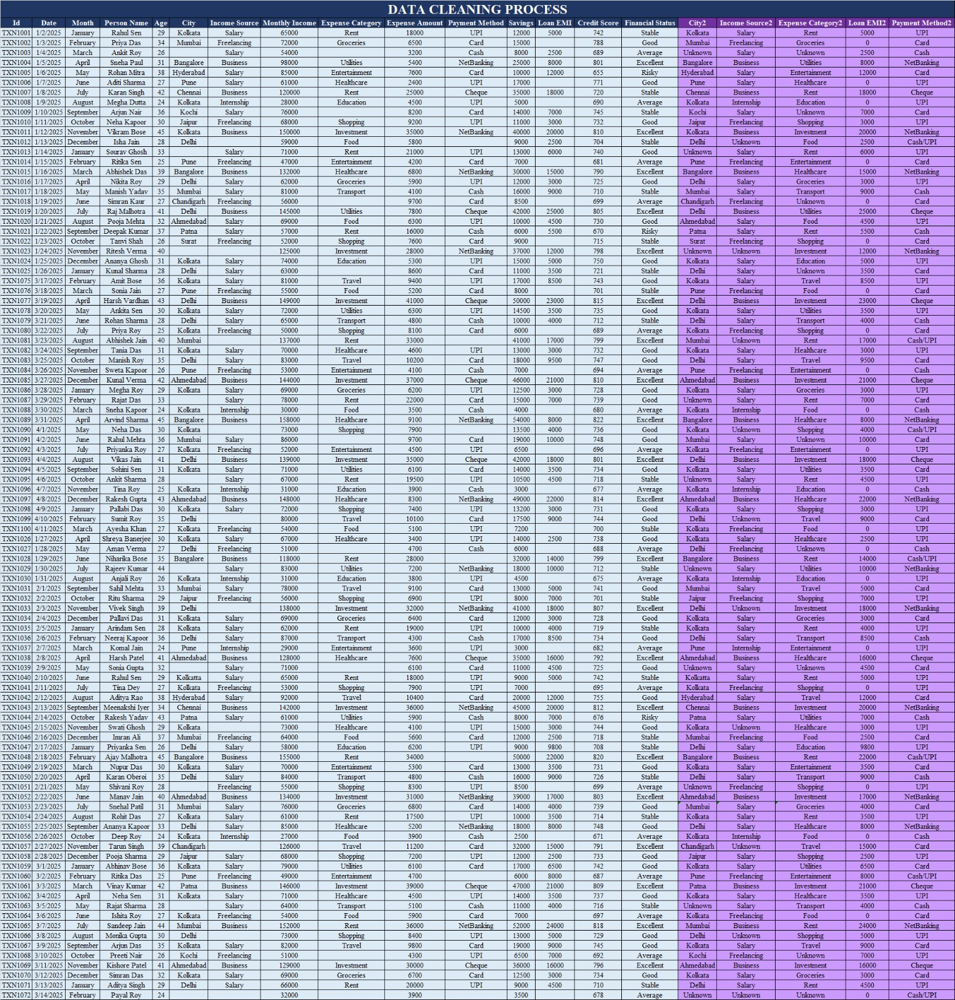
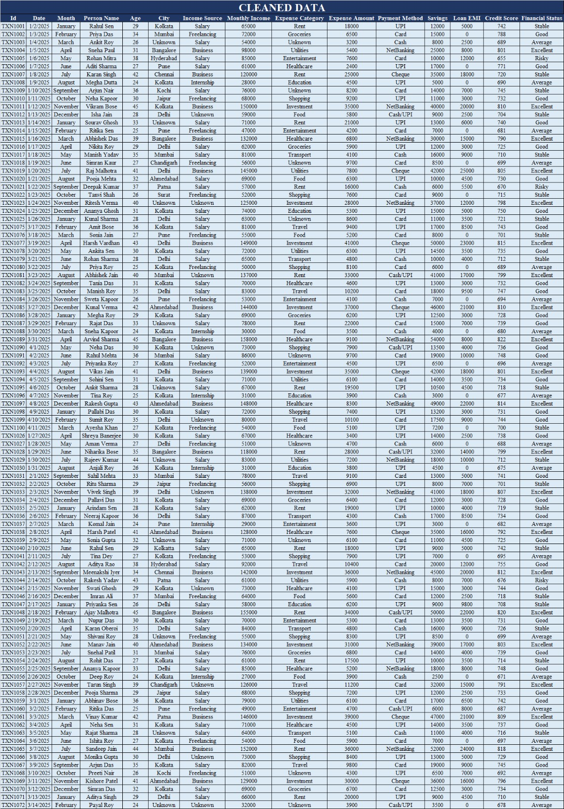
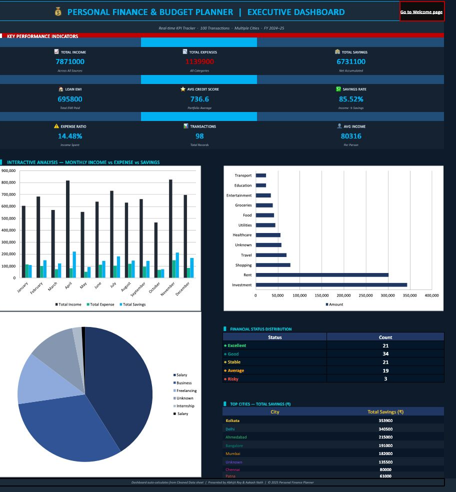
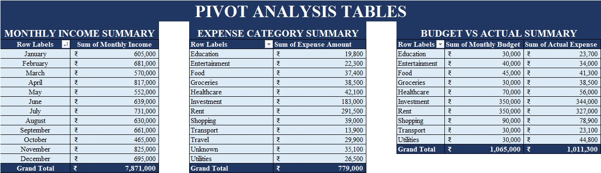
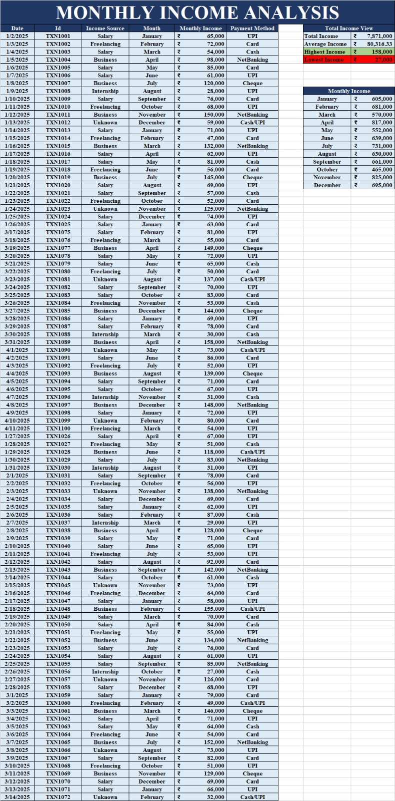
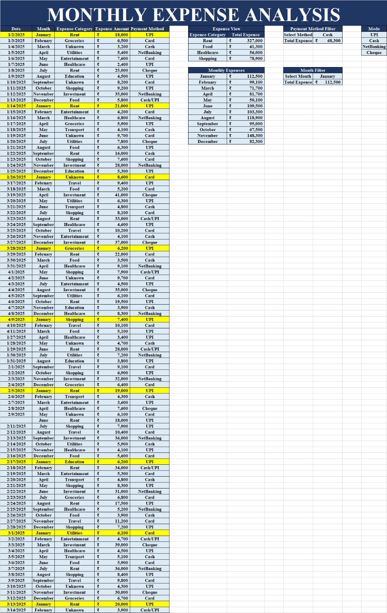
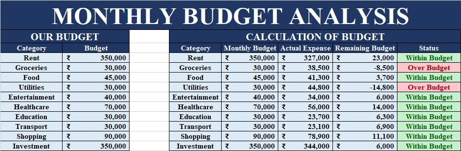

# 💰📊 PERSONAL FINANCE & BUDGET PLANNER DASHBOARD

### 🚀 Microsoft Excel Financial Analytics & Dashboard Project  
### 🏢 Anudip Foundation Project

---

# 📌 Project Overview

The **Personal Finance & Budget Planner Dashboard** is an interactive Microsoft Excel project developed to analyze, organize, and visualize financial data efficiently. This project provides a complete financial overview including **income tracking, expense analysis, savings monitoring, and budget performance evaluation** through professional dashboard components.

The dashboard combines **Pivot Tables, KPI Cards, Charts, Hyperlinks, Data Cleaning techniques, and Financial Analytics** to create a visually appealing and user-friendly reporting system.

This project demonstrates practical implementation of:

✨ Financial Data Analysis  
✨ Interactive Dashboard Development  
✨ Data Cleaning & Preprocessing  
✨ Pivot Table Reporting  
✨ KPI Visualization  
✨ Budget Monitoring & Expense Tracking  

---

# 🎯 Project Objectives

This dashboard helps users to:

✅ Track monthly income and expenses  
✅ Analyze category-wise spending patterns  
✅ Monitor savings and remaining budget  
✅ Compare budget vs actual expenses  
✅ Visualize financial trends using charts  
✅ Perform data cleaning and preprocessing  
✅ Navigate sheets using interactive hyperlinks  
✅ Build professional Excel dashboards for analysis  

---

# 🏗️ Dashboard Workflow

```text
Raw Data → Data Cleaning → Cleaned Data → Pivot Tables → Dashboard Visualization
```

## ⚙️ Workflow Steps

### 1️⃣ Raw Financial Data Collection
Original financial records collected and stored systematically.

### 2️⃣ Data Cleaning & Preprocessing
Data inconsistencies, formatting issues, and irregular entries corrected.

### 3️⃣ Cleaned Dataset Preparation
Structured dataset created for analysis and reporting.

### 4️⃣ Pivot Table Generation
Summary tables created for income, expense, and budget insights.

### 5️⃣ Dashboard Visualization
Interactive KPI cards and charts developed for analytics.

### 6️⃣ Hyperlink Navigation System
Connected all sheets for smooth and professional navigation.

---

# ⚡ Key Features

📊 Interactive KPI Dashboard  
📈 Monthly Income Trend Analysis  
💸 Expense Category Analysis  
🏦 Budget vs Actual Expense Comparison  
📋 Pivot Tables & Pivot Charts  
🎨 Professional Dashboard Design  
🔗 Hyperlink Navigation System  
🧹 Data Cleaning & Preprocessing  
📉 Financial Performance Visualization  
📁 Structured Multi-Sheet Workbook  

---

# 🧰 Tools & Technologies Used

## 💻 Microsoft Excel Features

- Pivot Tables
- Pivot Charts
- KPI Cards
- Conditional Formatting
- Hyperlinks
- Formulas & Functions
- Data Validation
- Dashboard Design

---

# 📁 Workbook Structure

```text
Welcome Page
│
├── Raw Data
├── Cleaning Tasks
├── Cleaned Data
├── Dashboard
├── Pivot Tables
├── Income Analysis
├── Expense Analysis
└── Budget Analysis
```

---

# 📊 Dashboard Components

## 🏠 1️⃣ Welcome Page
Interactive homepage containing hyperlinks to all sheets.

## 📄 2️⃣ Raw Data
Contains original financial transaction records before preprocessing.

## 🧹 3️⃣ Cleaning Tasks
Includes all data cleaning and preprocessing operations.

## 📑 4️⃣ Cleaned Data
Processed and structured dataset prepared for analysis.

## 📊 5️⃣ Final Dashboard
Interactive financial dashboard with KPI cards and charts.

## 📋 6️⃣ Pivot Tables
Summary reports generated using Pivot Tables.

## 💰 7️⃣ Income Analysis
Monthly income tracking and trend visualization.

## 💸 8️⃣ Expense Analysis
Category-wise expense monitoring and comparison.

## 🏦 9️⃣ Budget Analysis
Budget planning versus actual spending analysis.

---

# 📌 KPI Metrics Included

💰 Total Income  
💸 Total Expense  
🏦 Total Savings  
📊 Remaining Budget  
💳 Average Credit Score  

---

# 📈 Charts Included

📉 Monthly Income Trend Chart  
📊 Expense Category Analysis Chart  
📋 Budget vs Actual Analysis Chart  

---

# 📸 Project Screenshots

## 🏠 Welcome Page


## 📄 Raw Data


## 🧹 Cleaning Tasks


## ✅ Cleaned Data


## 📊 Final Dashboard


## 📋 Pivot Tables


## 💰 Income Analysis


## 💸 Expense Analysis


## 🏦 Budget Analysis


---

# 🎯 Key Insights

✅ Identified major spending categories  
✅ Compared actual expenses with planned budget  
✅ Tracked monthly financial growth trends  
✅ Evaluated savings performance  
✅ Improved financial data organization and reporting  

---

# 🌟 Project Highlights

✨ Professional Dashboard UI  
✨ Interactive Hyperlink Navigation  
✨ Realistic Financial Dataset  
✨ Practical Use of Excel Analytics  
✨ End-to-End Dashboard Development Workflow  
✨ Clean & Structured Workbook Design  

---

# 👨‍💻 Presented By

### 👤 Aakash Nath  
### 👤 Abhijit Roy  

---

# 🏢 Organization

### Anudip Foundation

---

# 📌 Conclusion

The **Personal Finance & Budget Planner Dashboard** demonstrates how Microsoft Excel can be effectively used for **financial analytics, dashboard visualization, and data management**.

This project integrates **data cleaning, Pivot Table reporting, KPI tracking, financial trend analysis, and interactive dashboard design** to build a professional financial analytics solution with a clean and modern user experience.

---

# ⭐ If You Like This Project

Give this project a ⭐ on GitHub to support and appreciate the work!
